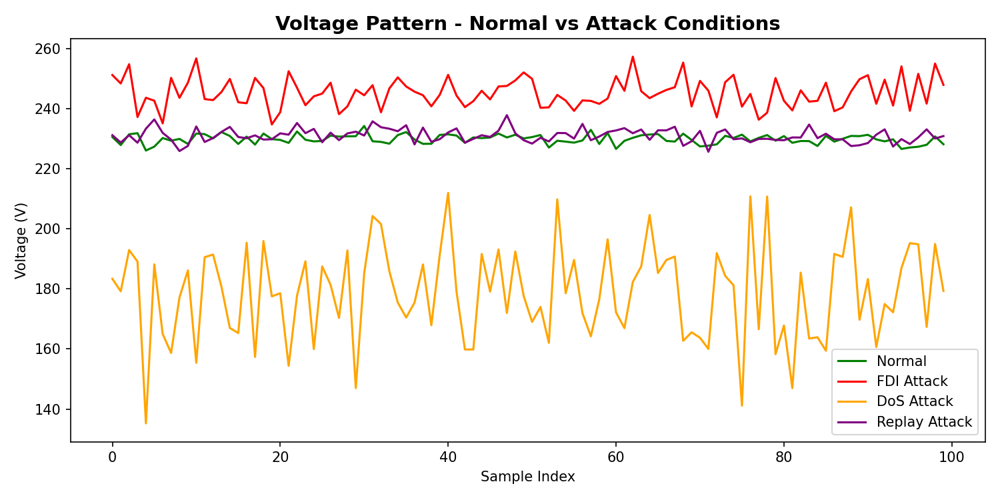
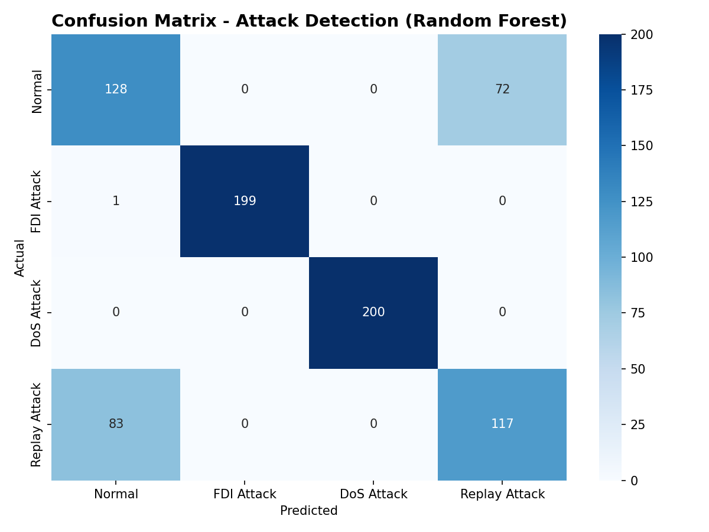
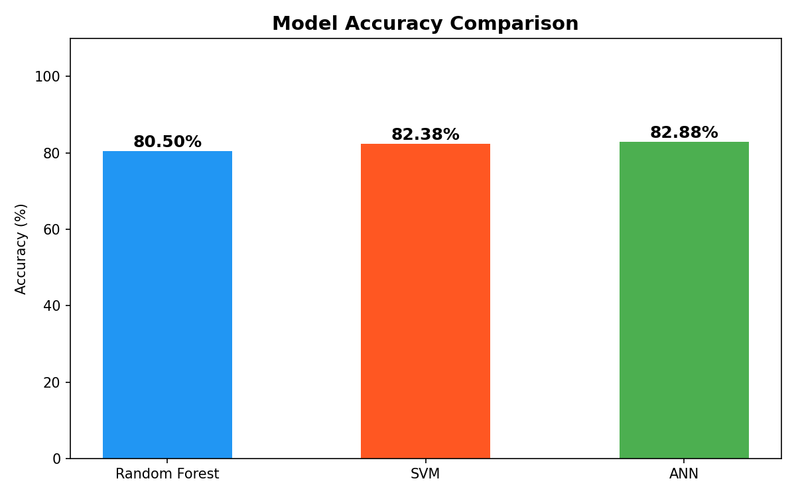
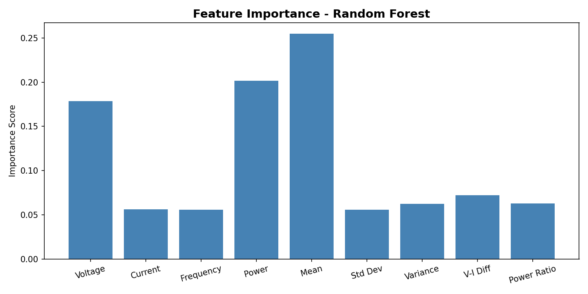
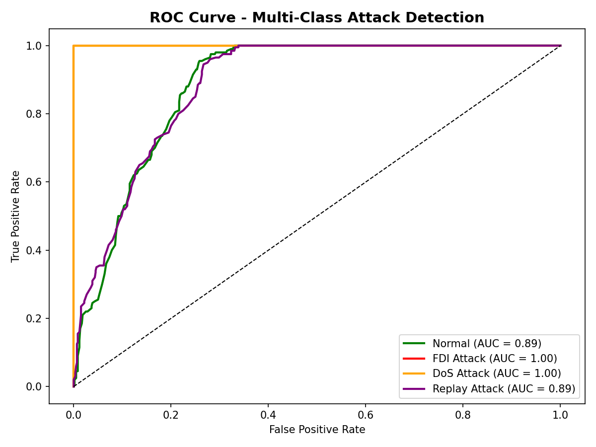
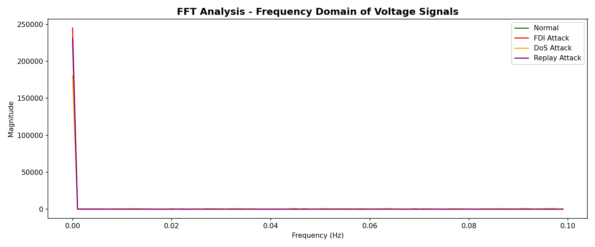
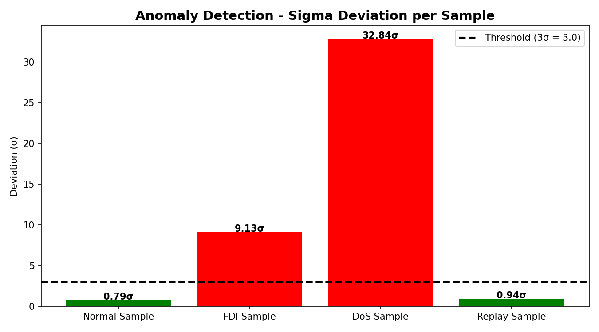

# ⚡ Microgrid Cyberattack Detection & Mitigation System

A machine learning pipeline that detects cyberattacks on smart microgrid sensor
data (voltage, current, frequency, power) in real time and triggers an
automated mitigation response — built as a cybersecurity + machine learning
internship project.


---

## 📌 Problem Statement

Modern microgrids rely on continuous sensor telemetry (voltage, current,
frequency) to balance load and generation. This makes them a target for
cyberattacks that manipulate or disrupt that telemetry:

| Attack | Description |
|---|---|
| **False Data Injection (FDI)** | Attacker spoofs sensor readings (e.g. inflated voltage/current) to mislead grid control decisions |
| **Denial of Service (DoS)** | Attacker floods/blocks the communication channel, causing degraded, noisy, or missing readings |
| **Replay Attack** | Attacker re-transmits old, legitimate-looking sensor data to mask a real event |

Undetected, these attacks can cause equipment damage, blackouts, or unsafe
load-shedding decisions. This project builds a **classifier that detects
which of these states the grid is in from raw sensor readings, and pairs
each detection with an automated mitigation action.**

---

## 🧠 Approach

```
Sensor data (V, I, f, P)
        │
        ▼
Statistical feature extraction (9 features)
        │
        ▼
Train / test split (80 / 20, stratified)
        │
        ▼
┌───────────────┬───────────────┬───────────────┐
│ Random Forest │      SVM      │  ANN (MLP)    │  ← trained & compared
└───────────────┴───────────────┴───────────────┘
        │
        ▼
Evaluation: accuracy, confusion matrix, ROC-AUC, feature importance
        │
        ▼
Signal analysis: FFT (frequency domain) + 3-sigma anomaly detection
        │
        ▼
Automated mitigation action per detected class
```

### Dataset

Since real attack telemetry from a live microgrid isn't publicly available,
the dataset is **synthetically generated** (`numpy`, seeded for
reproducibility) to model four distinct operating conditions — 1,000 samples
each, 4,000 total:

- **Normal**: voltage ~ N(230V, 2), current ~ N(10A, 0.5), frequency ~ N(50Hz, 0.1)
- **FDI**: shifted, higher-variance voltage/current (spoofed values)
- **DoS**: degraded, high-variance, lower voltage/frequency (communication loss)
- **Replay**: near-identical to normal but with a small frequency drift (stale/re-sent data)

### Features

From each sample's raw `(voltage, current, frequency, power)` reading, 9
statistical features are engineered: the four raw values plus mean, standard
deviation, and variance across (V, I, f), the voltage–current difference,
and the power-to-voltage ratio.

### Models compared

| Model | Notes |
|---|---|
| **Random Forest** | Primary model — also used for feature importance & ROC analysis |
| **SVM (RBF kernel)** | Trained on standardized features |
| **ANN (MLP, 64→32 hidden units)** | Trained on standardized features |

---

## 📊 Results

| Model | Accuracy |
|---|---|
| Random Forest | **80.50%** |
| SVM (RBF) | 82.38% |
| ANN (MLP) | 82.88% |

**Random Forest — per-class performance:**

| Class | Precision | Recall | F1-score |
|---|---|---|---|
| Normal | 0.60 | 0.64 | 0.62 |
| FDI Attack | 1.00 | 0.99 | 1.00 |
| DoS Attack | 1.00 | 1.00 | 1.00 |
| Replay Attack | 0.62 | 0.58 | 0.60 |

FDI and DoS attacks are detected almost perfectly — their sensor signatures
are the most distinct from normal operation. Normal vs. Replay is the harder
distinction, which makes sense: a replay attack is designed to look like
legitimate normal data, so it's the most realistic "hard case" in the
dataset.

### Visualizations

| | |
|---|---|
|  |  |
|  |  |
|  |  |
|  | |

### Automated mitigation logic

Each real-time prediction is paired with a response action:

| Detected state | Mitigation action |
|---|---|
| Normal | No action needed |
| FDI Attack | Isolate affected sensor, switch to backup data source |
| DoS Attack | Activate islanded mode, redistribute loads |
| Replay Attack | Reset communication channel, activate backup controller |

---

## 🗂️ Project structure

```
microgrid-attack-detection/
├── microgrid_attack_detection.py   # full pipeline (data → models → plots → mitigation)
├── requirements.txt
├── outputs/                        # generated charts (created on run)
│   ├── voltage_comparison.png
│   ├── confusion_matrix.png
│   ├── model_comparison.png
│   ├── feature_importance.png
│   ├── roc_curve.png
│   ├── fft_analysis.png
│   └── anomaly_detection.png
└── README.md
```

## ▶️ How to run

```bash
git clone https://github.com/<your-username>/microgrid-attack-detection.git
cd microgrid-attack-detection
pip install -r requirements.txt
python microgrid_attack_detection.py
```

This regenerates the synthetic dataset, trains all three models, prints
accuracy/classification reports to the console, and saves all charts to
`outputs/`.

---

## 🛠️ Tech stack

- **Python** — numpy, pandas
- **scikit-learn** — RandomForestClassifier, SVC, MLPClassifier, train/test split, metrics
- **matplotlib / seaborn** — visualizations
- **numpy.fft** — frequency-domain signal analysis

## 🔭 Future improvements

- Replace synthetic data with a real or public SCADA/microgrid attack dataset
- Add real-time streaming detection (sliding window over live sensor feed)
- Hyperparameter tuning (GridSearchCV) for SVM/ANN
- Deploy as a lightweight API (FastAPI) with a live dashboard

---

## 👤 Author

Built as an internship project on cybersecurity for smart microgrids.

